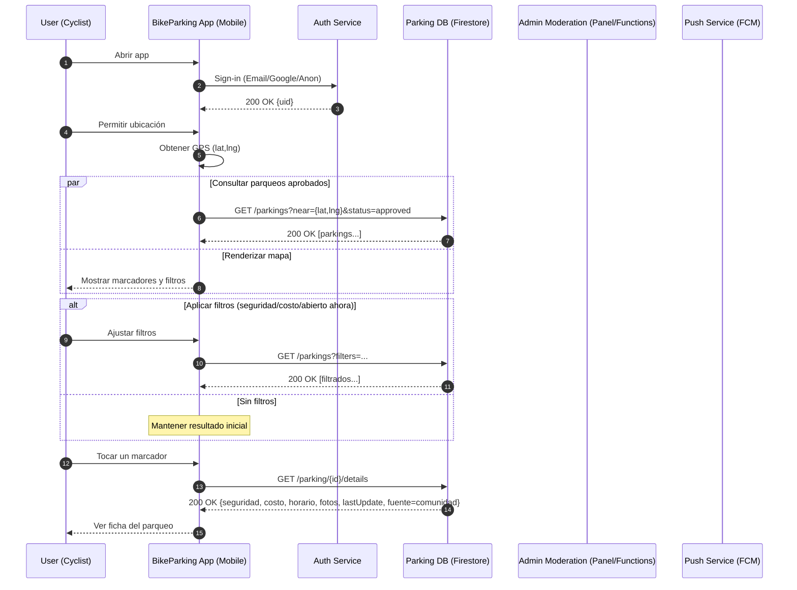

# Diagramas de Secuencia

## Buscar y Localizar parqueos cercanos

Diagrama de secuencia de la funcionalidad "Buscar y localizar parqueos cercanos" en una aplicación móvil para ciclistas

```mermaid
sequenceDiagram
autonumber
participant U as User (Cyclist)
participant APP as BikeParking App (Mobile)
participant AUTH as Auth Service
participant DB as Parking DB (Firestore)
participant MOD as Admin Moderation (Panel/Functions)
participant PUSH as Push Service (FCM)

    %% UC-01: Buscar y localizar parqueos cercanos (con datos de la comunidad)
    U->>APP: Abrir app
    APP->>AUTH: Sign-in (Email/Google/Anon)
    AUTH-->>APP: 200 OK {uid}

    U->>APP: Permitir ubicación
    APP->>APP: Obtener GPS (lat,lng)

    par Consultar parqueos aprobados
        APP->>DB: GET /parkings?near={lat,lng}&status=approved
        DB-->>APP: 200 OK [parkings...]
    and Renderizar mapa
        APP-->>U: Mostrar marcadores y filtros
    end

    alt Aplicar filtros (seguridad/costo/abierto ahora)
        U->>APP: Ajustar filtros
        APP->>DB: GET /parkings?filters=...
        DB-->>APP: 200 OK [filtrados...]
    else Sin filtros
        Note over APP: Mantener resultado inicial
    end

    U->>APP: Tocar un marcador
    APP->>DB: GET /parking/{id}/details
    DB-->>APP: 200 OK {seguridad, costo, horario, fotos, lastUpdate, fuente=comunidad}
    APP-->>U: Ver ficha del parqueo
```
