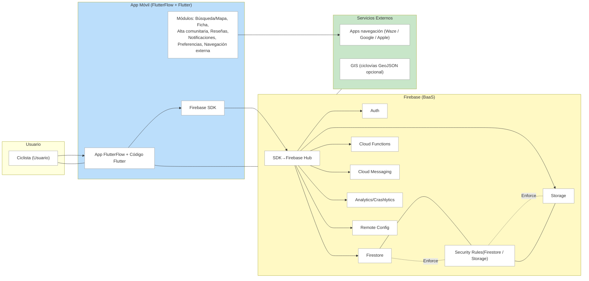

# Diagrama de la arquitectura

```mermaid
flowchart LR
 subgraph Usuario["Usuario"]
        U["Ciclista (Usuario)"]
  end
 subgraph App_Movil["App Móvil (FlutterFlow + Flutter)"]
        APP["App FlutterFlow + Código Flutter"]
        SDK["Firebase SDK"]
        MODS@{ label: "<span style=\"padding-left:\">Módulos: Búsqueda/Mapa, Ficha,<br></span><span style=\"padding-left:\">Alta comunitaria, Reseñas,<br></span><span style=\"padding-left:\">Notificaciones, Preferencias, Navegación externa</span>" }
  end
 subgraph Firebase["Firebase (BaaS)"]
        HUB["SDK→Firebase Hub"]
        AUTH["Auth"]
        FS["Firestore"]
        ST["Storage"]
        CF["Cloud Functions"]
        FCM["Cloud Messaging"]
        AN["Analytics/Crashlytics"]
        RC["Remote Config"]
        SECR["Security Rules(Firestore / Storage)"]
  end
 subgraph Externos["Servicios Externos"]
        NAV["Apps navegación (Waze / Google / Apple)"]
        GIS["GIS (ciclovías GeoJSON opcional)"]
  end
    U --> APP
    APP --> SDK
    SDK --> HUB
    HUB --> AUTH & FS & ST & CF & FCM & AN & RC
    SECR -. Enforce .- FS & ST
    MODS --> NAV
    U --- APP
    APP --- Firebase
    Firebase --- Externos
    FS --- SECR
    ST --- SECR

    MODS@{ shape: rect}
     U:::box
     APP:::box
     SDK:::box
     MODS:::box
     HUB:::box
     AUTH:::box
     FS:::box
     ST:::box
     CF:::box
     FCM:::box
     AN:::box
     RC:::box
     SECR:::box
     NAV:::box
     GIS:::box
    classDef grp fill:#f7fbff,stroke:#7aa6d8
    classDef grp2 fill:#fff8e1,stroke:#f4c95d
    classDef box fill:#ffffff,stroke:#9e9e9e
    style Firebase fill:#FFF9C4
    style Externos fill:#C8E6C9
    style App_Movil fill:#BBDEFB
```
