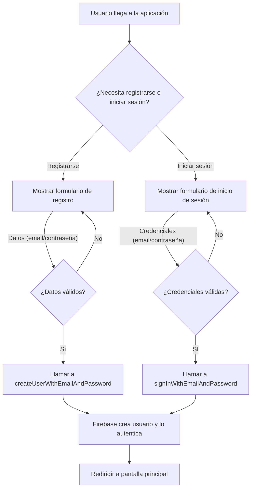

# Diagramas de Flujo

# Autenticación

```mermaid
graph TD
    A[Usuario llega a la aplicación] --> B{¿Necesita registrarse o iniciar sesión?};
    B -- Registrarse --> C[Mostrar formulario de registro];
    C -- Datos (email/contraseña) --> D{¿Datos válidos?};
    D -- Sí --> E[Llamar a createUserWithEmailAndPassword];
    E --> F[Firebase crea usuario y lo autentica];
    F --> G[Redirigir a pantalla principal];
    D -- No --> C;
    B -- Iniciar sesión --> H[Mostrar formulario de inicio de sesión];
    H -- Credenciales (email/contraseña) --> I{¿Credenciales válidas?};
    I -- Sí --> J[Llamar a signInWithEmailAndPassword];
    J --> F;
    I -- No --> H;
```
