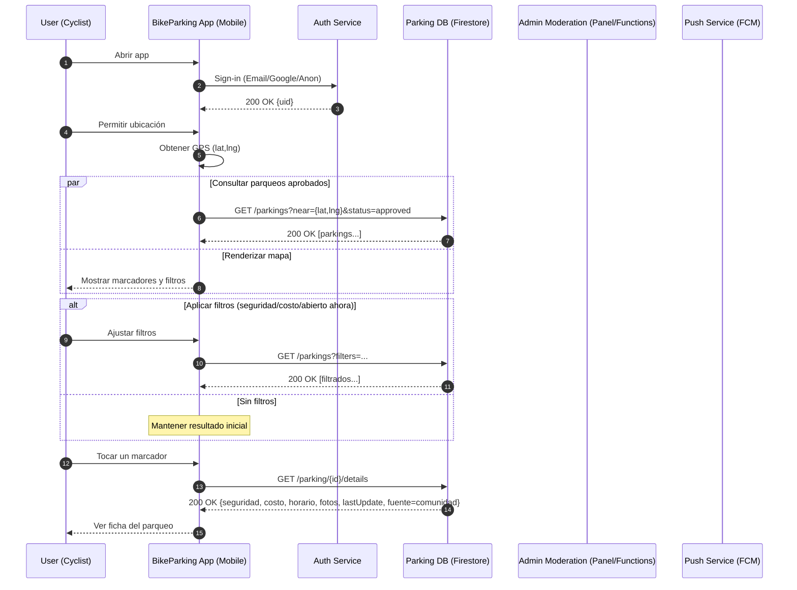
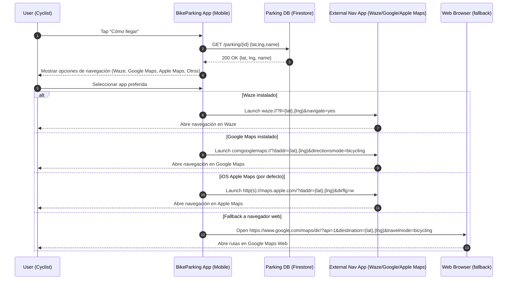
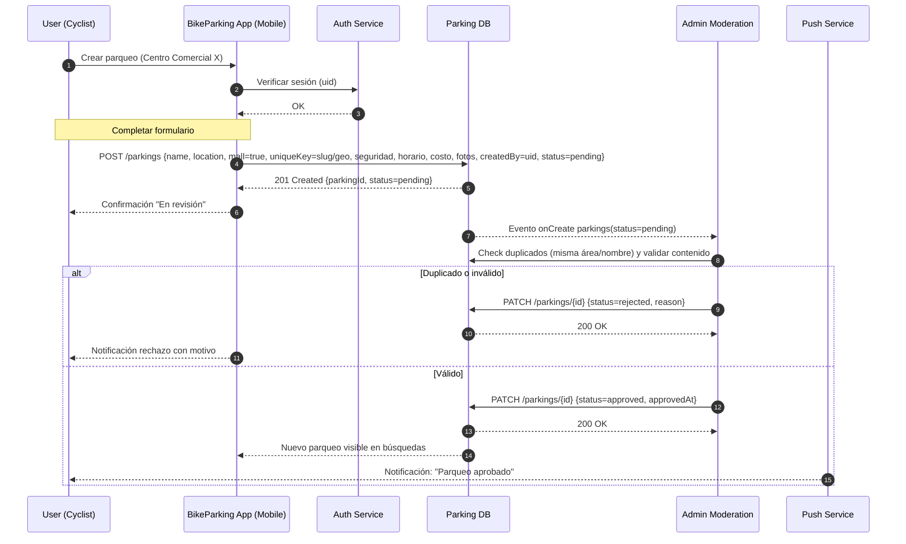
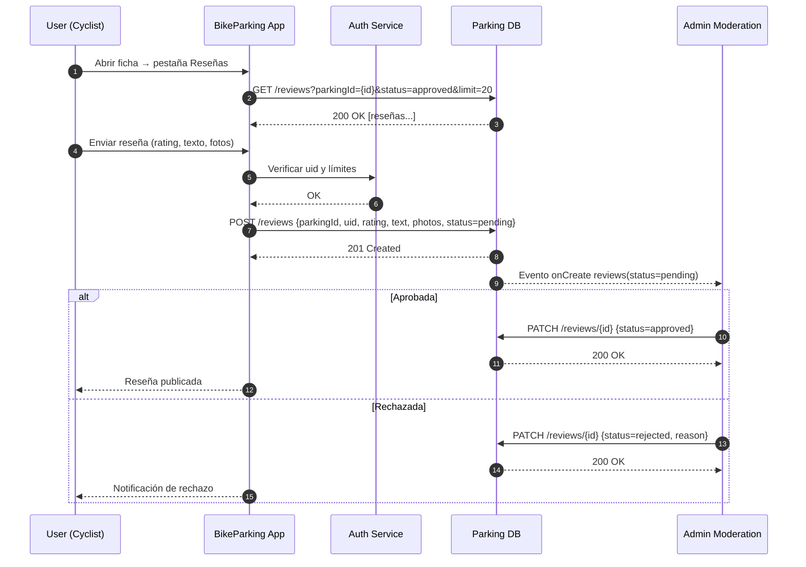
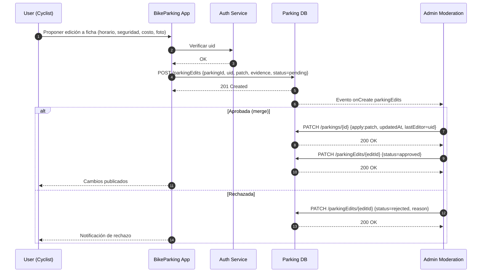

# Diagramas de Secuencia

## Buscar y Localizar parqueos cercanos

Diagrama de secuencia de la funcionalidad "Buscar y localizar parqueos cercanos" en una aplicación móvil para ciclistas

## Navegar hacia un parqueo

Diagrama de secuencia que de la funcionalidad de redirigir al usuario hacia una aplicación de rutas

## Creación de un nuevo parqueo

Diagrama que explica el proceso de creación de un nuevo parqueo

## Envío de reseña

Diagrama que muestra el flujo a la hora de que el usuario sube una reseña

## Diagrama de secuencia para cambios en parqueos

